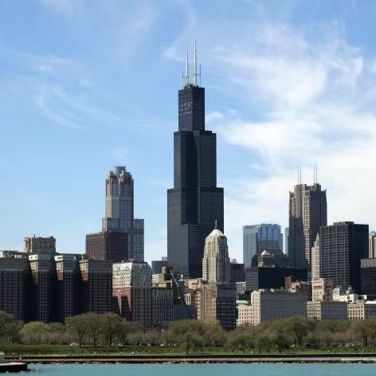
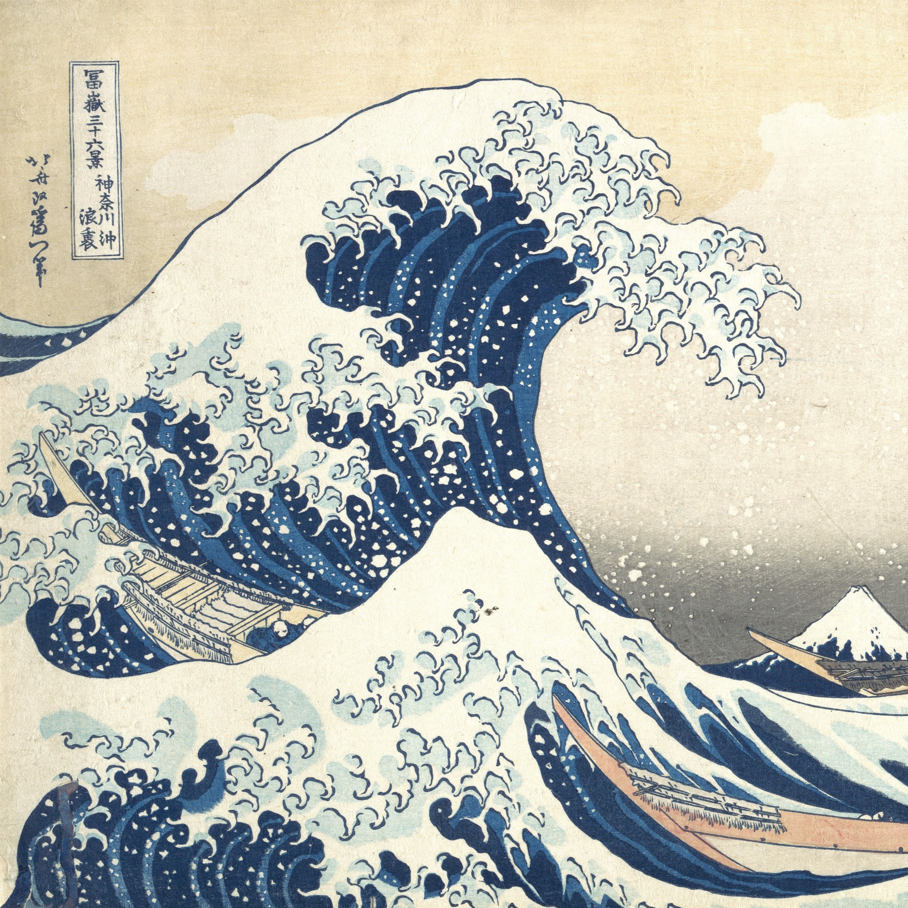
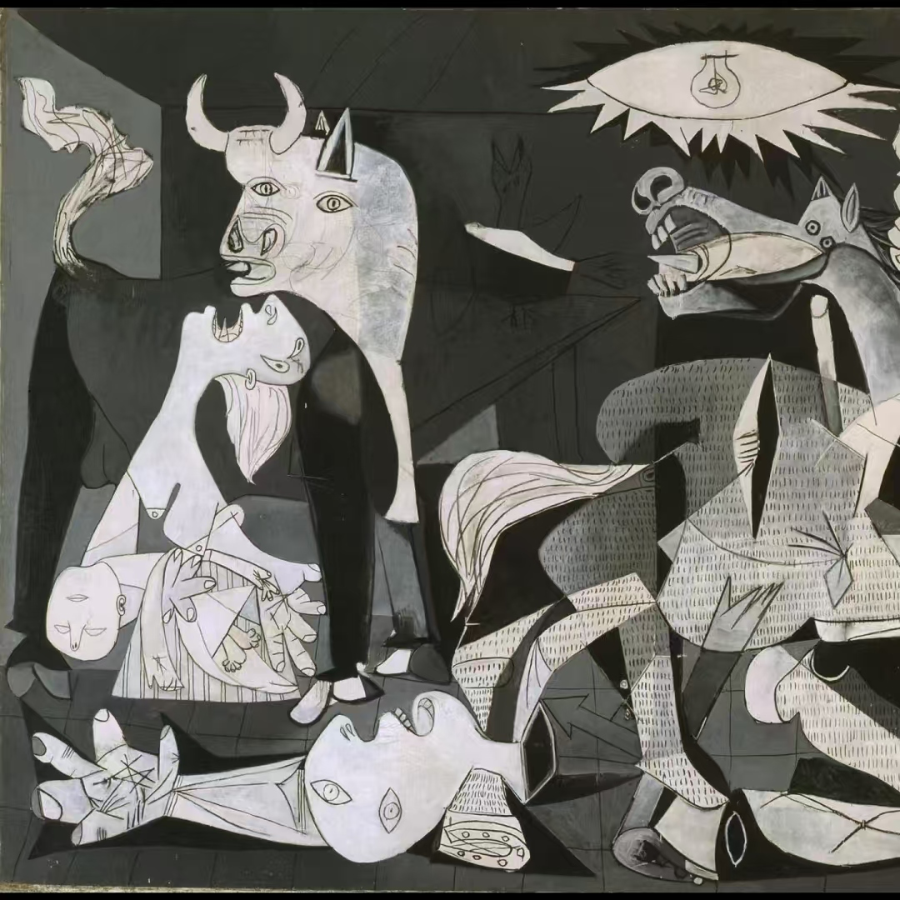

<div align="center">
<h1>Multi-to-One Style Transfer: Region-Based Styles Assignment for Single Content Image</h1>
</div>

> :hammer_and_wrench: in development

## Introduction

**Multi-to-One Style Transfer** is a novel style transfer method, aiming to assemble various styles like puzzle pieces to construct a stylized image :art: 

## Requirements

- Python 3.8 or later
- Conda

## Usage

1. Clone this repository:

   ```bash
   git clone https://github.com/Charles-T-T/M2O_StyleTransfer.git
   ```

2. Create and activate the Conda environment:

   ```bash
   conda env create -f environment.yml
   conda activate StyleTransfer
   ```

3. Run the `M2O_StyleTransfer.py` :

   ```bash
   cd src
   python M2O_StyleTransfer.py
   ```

   You can choose your own style images and content images by adding arguments like this: 

   ```bash
   python M2O_StyleTransfer.py --style_paths path/to/style1 path/to/style2 --content_path path/to/content
   ```

   Run `python M2O_StyleTransfer.py --help` to see all arguments:

   ```bash
   usage: M2O_StyleTransfer.py [-h] [--style_paths STYLE_PATHS [STYLE_PATHS ...]] [--content_path CONTENT_PATH] [--save_dir SAVE_DIR] [--n_epoch N_EPOCH]
   
   Multi-to-One Style Transfer
   
   optional arguments:
     -h, --help            show this help message and exit
     --style_paths STYLE_PATHS [STYLE_PATHS ...]
                           Paths to style images (provide multiple paths separated by space)
     --content_path CONTENT_PATH
                           Path to the content image
     --save_dir SAVE_DIR   Directory to save the result image
     --n_epoch N_EPOCH     Number of training epochs, default to 1000
   ```

## Demo

|                           Content                            |                            Styles                            |                            Result                            |
| :----------------------------------------------------------: | :----------------------------------------------------------: | :----------------------------------------------------------: |
|  |   |  |

